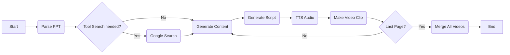

# 🎬 AI Instructor Agent: PPT to Video Generator

[](https://www.python.org/)
[](https://www.langchain.com/)
[](https://openai.com/)
[](https://gradio.app/)

> **"PPT 파일만 업로드하세요. 대본 작성부터 음성 합성, 영상 제작까지 AI가 수행합니다."** > LangGraph 기반의 멀티모달 에이전트 워크플로우를 활용한 자동화 강의 영상 제작 서비스입니다.

---

## 1. Demo & Result

*(여기에 실제 구동 화면 GIF나 결과물 영상 캡처본을 넣어주세요. 방문자의 시선을 가장 먼저 사로잡는 곳입니다.)*


* **입력:** 비즈니스 계획서, 기술 소개서 등 `.pptx` 파일
* **출력:** AI 강사가 설명하는 `.mp4` 강의 영상

---

## 2. Key Features

이 프로젝트는 정적인 문서를 동적인 영상 콘텐츠로 변환하는 **End-to-End AI Pipeline**을 구축했습니다.

* [cite_start]**📊 PPT 구조화 (Multimodal Parsing):** `python-pptx`를 활용하여 슬라이드 내 텍스트, 표, 이미지를 각각 분리하여 추출하고 구조화합니다. [cite: 1264]
* [cite_start]**🤖 LangGraph 기반 워크플로우:** 순차적인 작업 흐름(Parsing → Scripting → TTS → Video)을 그래프(Graph) 형태로 설계하여 안정적인 상태(State) 관리를 구현했습니다. [cite: 1250]
* [cite_start]**📝 문맥 인식 대본 생성 (Context-Aware Scripting):** 단순히 텍스트를 읽는 것이 아니라, 이전 슬라이드의 맥락을 고려하고 부족한 정보는 **SerpAPI(구글 검색)**를 통해 보완하여 풍부한 해설 대본을 작성합니다. 
* [cite_start]**🗣️ 자연스러운 음성 합성 (TTS):** OpenAI의 `gpt-4o-mini-tts` 모델을 사용하여 `alloy`, `echo` 등 다양한 톤의 네레이션을 생성합니다. [cite: 1238, 1502]
* [cite_start]**🎬 자동 영상 병합:** `FFmpeg`를 활용하여 생성된 음성과 슬라이드 이미지를 결합, 최종 강의 영상을 렌더링합니다. [cite: 1276]

---

## 3. Tech Stack

| Category | Technology | Description |
| :--- | :--- | :--- |
| **Language** | Python | Main Programming Language |
| **Framework** | **LangChain & LangGraph** | [cite_start]State-based Agent Workflow Orchestration [cite: 1250] |
| **LLM** | **OpenAI GPT-4o-mini** | [cite_start]Multimodal content understanding & Script generation [cite: 1223] |
| **TTS** | OpenAI TTS | [cite_start]Text-to-Speech (gpt-4o-mini-tts) [cite: 1238] |
| **Tools** | python-pptx | [cite_start]PowerPoint parsing & data extraction [cite: 1264] |
| **Search** | SerpAPI | [cite_start]Google Search Tool for context enrichment [cite: 1616] |
| **Video** | FFmpeg | [cite_start]Audio/Video processing & merging [cite: 1276] |
| **UI/UX** | Gradio | [cite_start]Web Interface for easy interaction [cite: 1697] |

---

## 4. System Architecture

이 프로젝트는 **LangGraph**를 사용하여 각 단계(Node)를 정의하고, `State`를 통해 데이터를 순환시키는 구조로 설계되었습니다.

### 🛠️ Workflow Diagram
*(아래는 프로젝트 PDF의 그래프 흐름을 도식화한 것입니다. 다이어그램 이미지가 있다면 교체하세요.)*



### 💾 State Management

각 노드 간 데이터 손실을 방지하고 작업 흐름을 제어하기 위해 `TypedDict`를 사용하여 전역 상태(Global State)를 정의했습니다.

```python
from typing import TypedDict, List, Dict

class State(TypedDict, total=False):
    # 기본 입력 정보
    pptx_path: str        # 업로드된 PPT 파일 경로
    work_dir: str         # 작업 디렉토리
    
    # 처리 상태
    slide_index: int      # 현재 처리 중인 슬라이드 인덱스
    
    # 추출된 산출물 (Parsing Result)
    texts: List[str]      # 슬라이드별 텍스트 리스트
    images: List[str]     # 슬라이드별 이미지 경로
    
    # 생성된 산출물 (Generation Result)
    page_content: str     # LLM이 요약한 페이지 내용
    script: str           # 생성된 강의 대본
    
    # 미디어 산출물 (Media Result)
    audio_path: str       # 생성된 TTS 오디오 파일 경로
    video_path: str       # 최종 병합된 영상 파일 경로
```

---

## 5. How to Run

이 프로젝트를 로컬 환경에서 실행하려면 다음 단계가 필요합니다.

### Prerequisites
* Python 3.10+
* **FFmpeg**: 영상 처리를 위해 시스템에 FFmpeg가 설치되어 있어야 합니다.

### Installation

1. **Clone the repository**
   ```bash
   git clone https://github.com/hyeoni0525/AI_agent.git
   cd AI_agent
   ```

2. **Install dependencies**
   ```bash
   pip install -r requirements.txt
   ```

3. **Set up API Keys**
   프로젝트 루트에 `.env` 파일을 생성하고 아래 키를 입력하세요.
   ```env
   OPENAI_API_KEY=sk-...
   SERPAPI_API_KEY=...  # 구글 검색용 (선택 사항)
   ```

4. **Run the App**
   Gradio 웹 인터페이스를 실행합니다.
   ```bash
   python app.py
   # 실행 후 생성되는 로컬 주소(http://127.0.0.1:7860)로 접속
   ```

---

## 6. Troubleshooting

* **State 관리의 복잡성:**
    * **문제:** PPT 파싱 데이터, 생성된 스크립트, 오디오 파일 등 다양한 데이터가 노드 간에 전달되면서 데이터 누락이나 동기화 문제가 발생했습니다.
    * **해결:** LangGraph의 `State` 스키마를 `TypedDict`로 명확히 정의하고, 각 노드의 입출력을 딕셔너리 형태로 엄격하게 관리하여 파이프라인의 안정성을 확보했습니다.

* **정보 부족으로 인한 환각(Hallucination):**
    * **문제:** PPT의 요약된 텍스트만으로는 LLM이 풍부한 해설을 하지 못하거나 문맥에 맞지 않는 내용을 생성하는 경우가 있었습니다.
    * **해결:** **SerpAPI**를 Tool로 연동하여, 슬라이드 제목이나 키워드를 검색해 외부 지식을 참조하도록 개선했습니다. 이를 통해 설명의 정확도와 풍부함을 높였습니다.

---

## 7. Retrospective

이번 프로젝트를 통해 **LangGraph를 활용한 Agent 제어 흐름(Control Flow)** 설계를 깊이 있게 경험했습니다. 단순한 LLM 호출을 넘어, PPT 파싱부터 영상 렌더링까지 이어지는 복합적인 멀티미디어 처리 파이프라인을 직접 구축했습니다.

* **성과:** 기존에 수작업으로 진행하던 강의 영상 제작 과정을 자동화하여 시간과 비용을 획기적으로 절감할 수 있는 가능성을 확인했습니다.
* **향후 계획:** 현재는 정지된 이미지 슬라이드만 영상화되지만, 향후에는 **SadTalker**와 같은 AI 아바타 기술을 접목하여 실제 강사가 말하는 듯한 생동감 있는 영상으로 고도화할 계획입니다.
